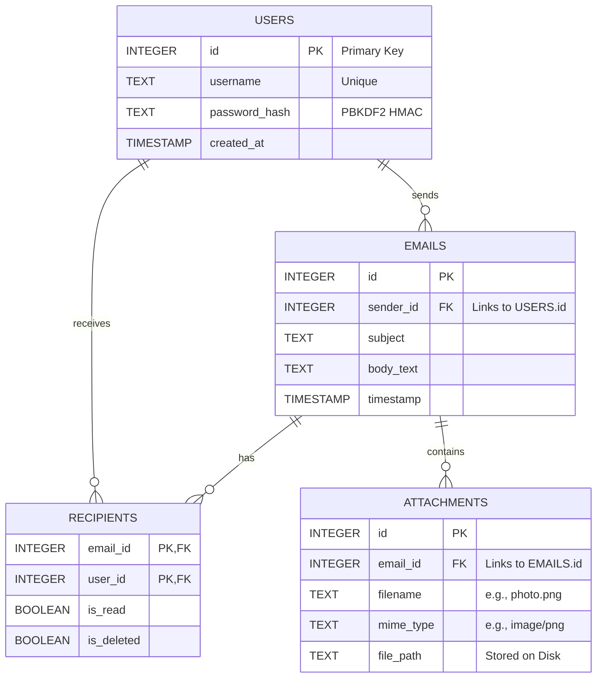
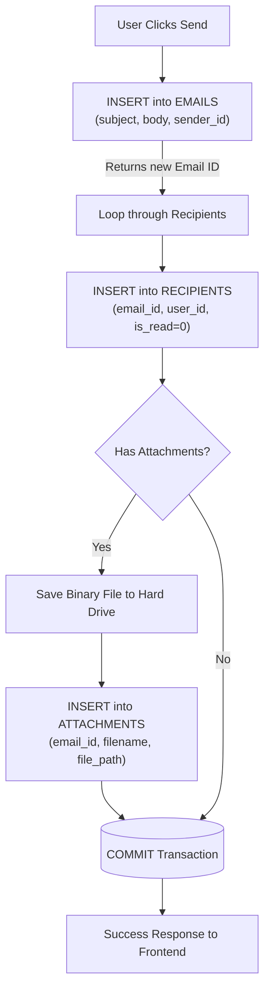

# Database Architecture

The backend of the MIME-Based Multimedia Email Handler uses **SQLite**, a file-based relational database. The schema is highly normalized to ensure data integrity, avoid redundancy, and optimize performance.

## Entity Relationship Diagram (ERD)

## Table Breakdowns

### 1. `users` Table
Stores registered users and authentication credentials.
* **`id`**: Unique identifier for the user.
* **`username`**: The login handle. Must be unique.
* **`password_hash`**: Secure cryptographic hash of the password. Plain-text passwords are never stored.
* **`created_at`**: UTC timestamp of registration.

### 2. `emails` Table
Stores the core content of the messages.
* **`id`**: Unique identifier for the email.
* **`sender_id`**: Foreign key pointing to the user who sent it.
* **`subject`**: Subject line.
* **`body_text`**: Main text payload.
* **`timestamp`**: Time of sending in UTC.

### 3. `recipients` Table (The Join Table)
Because an email can be sent to multiple users, we don't duplicate the heavy email body. We map it here.
* **`email_id`**: Links to the email.
* **`user_id`**: Links to the recipient user.
* **`is_read`**: Tracks if this specific user has opened the email (0=False, 1=True).
* **`is_deleted`**: Tracks if this specific user deleted the email from their inbox (soft delete).

### 4. `attachments` Table
Stores metadata for binary attachments. The actual binary blobs are saved to the server's filesystem, not the database.
* **`id`**: Unique attachment identifier.
* **`email_id`**: Links to the email this file belongs to.
* **`filename`**: Original file name.
* **`mime_type`**: The MIME type (e.g. `application/pdf`).
* **`file_path`**: The absolute or relative path to where the file is physically stored on the hard drive.

---

## Data Flow: Sending an Email

When a user sends an email with attachments to multiple recipients, the database executes a **Transaction** across three tables simultaneously:

